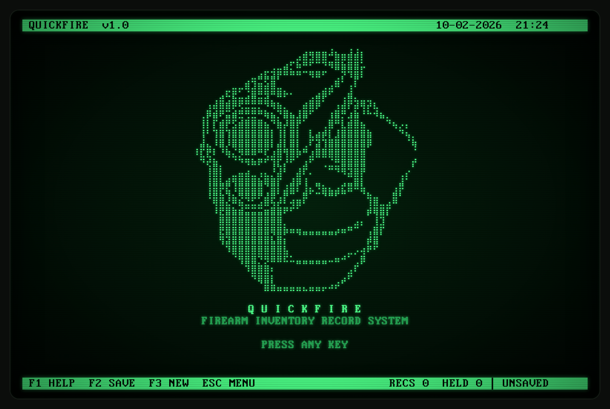
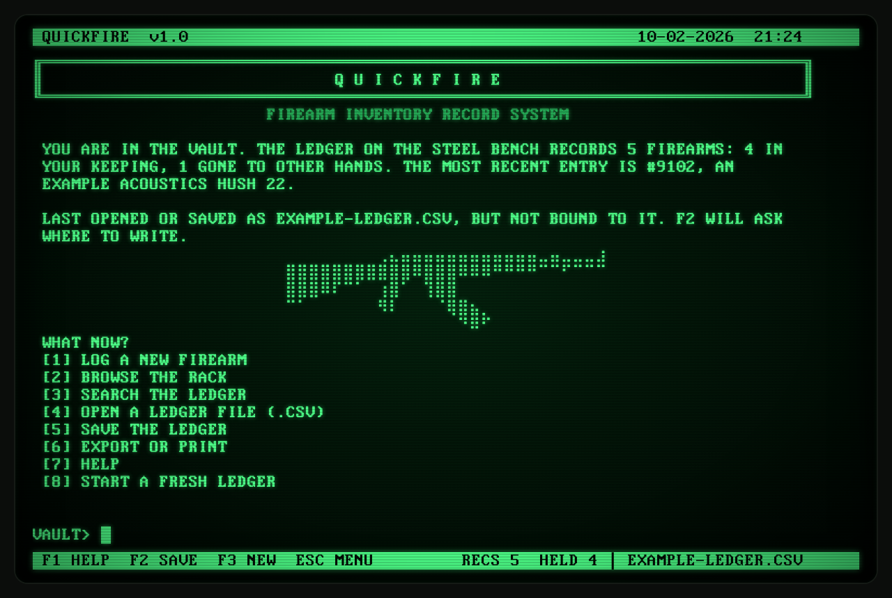
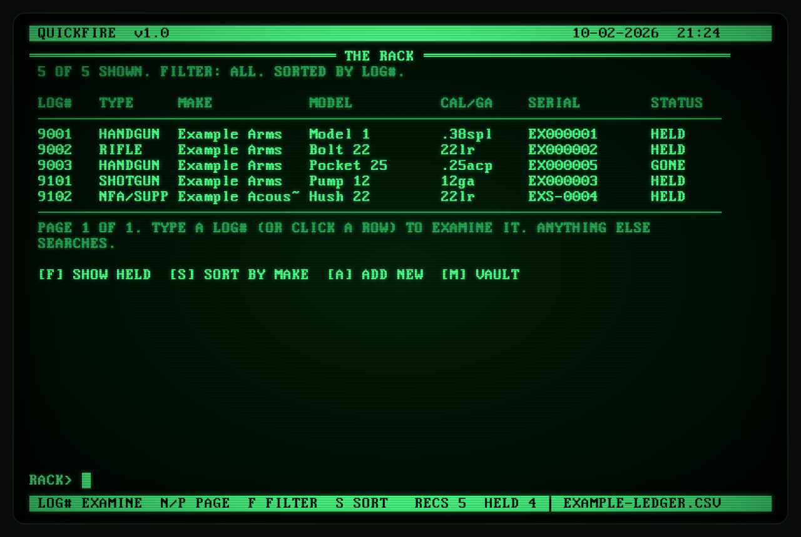
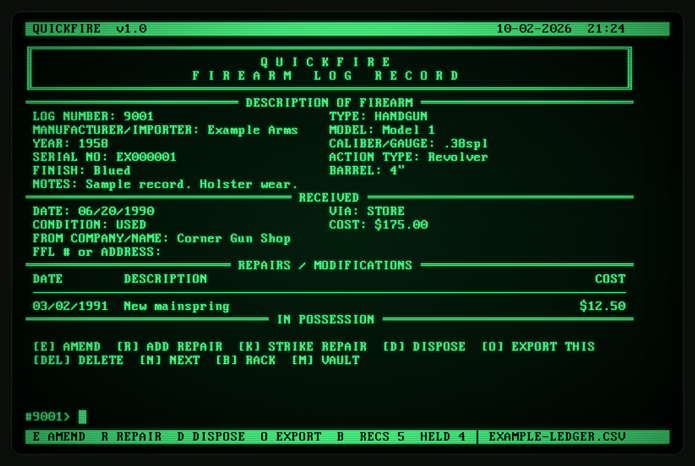
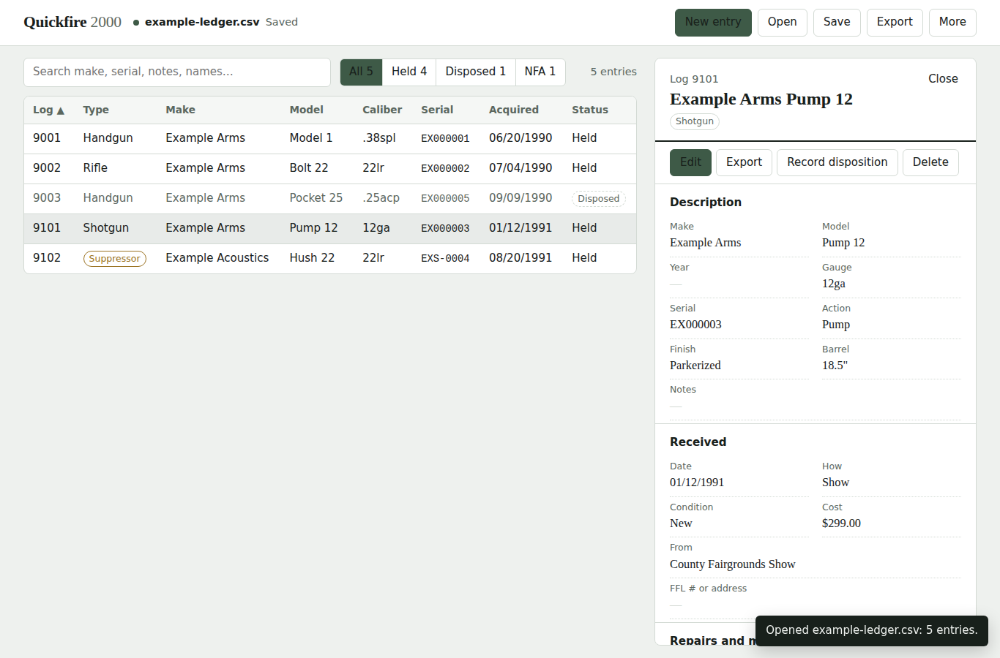
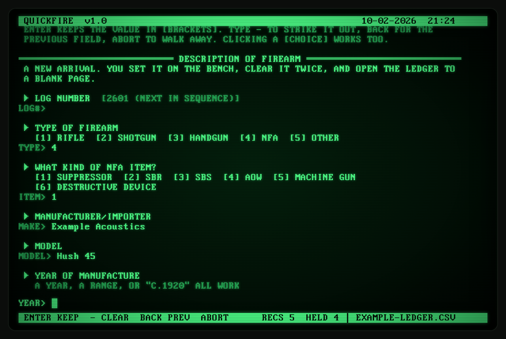
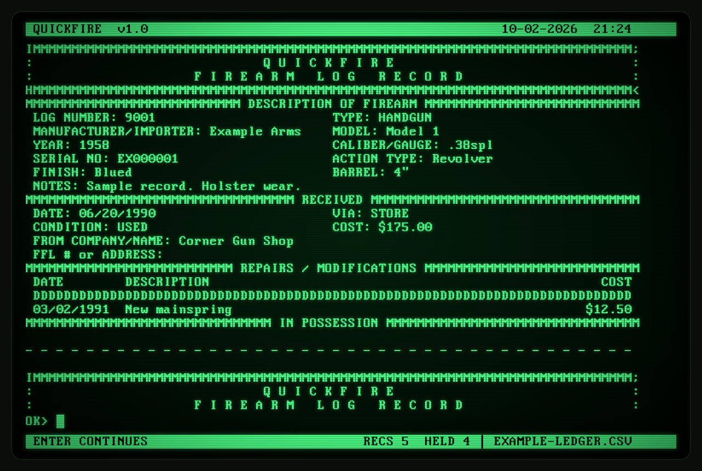

# QUICKFIRE

**A firearm inventory ledger for a green monochrome monitor that no longer exists.**

```
⠀⠀⠀⠀⠀⠀⠀⠀⢀⣄⣤⣤⣤⣤⣤⣤⣤⣤⣤⣤⣤⣤⣀⣤⣀⣀⣀⣰
⣿⣿⣿⣿⣿⣿⣿⣿⣿⣿⣿⠿⣿⣿⣿⠿⠿⠿⠛⠛⠛⠛⠉⠉⠋⠉⠉⠉⠉⠉
⣿⣿⣿⠿⠏⠉⠁⠀⢰⣿⠁⠀⢹⣿⣿
⠉⠁⠀⠀⠀⠀⠀⠀⠻⠇⠀⠀⠀⠈⢿⣿⣦⡀
⠀⠀⠀⠀⠀⠀⠀⠀⠀⠀⠀⠀⠀⠀⠀⠙⠿⠋
```

QUICKFIRE is a single HTML file. Open it in a browser and you get an 80-column DOS-era terminal that keeps a ledger of what you own: what came in, where it came from, what was done to it, and where it went. The ledger itself is a plain CSV file that you keep wherever you like. There is no server, no account, no install, and no build step.



---

## The lore

It started with a photograph of a magazine page from 1990.

The article included a screenshot of a program called the **Quickfire Inventory Record Screen**: a gun-inventory form drawn in a dot-matrix face, with fields for transaction number, manufacturer/importer, model, serial number, action type, caliber/gauge, and a "RECIEVED" section (sic) asking for the date, company, FFL number and address. Below it, a line promised "Continued from Form on page 11." On the facing page ran the instructions for ATF Form 5320.20, the application to transport NFA firearms across state lines. Someone had used a cash-register receipt from a gun shop, dated 6/20/90, as a bookmark.

The screen's borders looked strange. Instead of clean double lines, the form was fenced in with rows of letters, roughly like this:

```
IMMMMMMMMMMMMMMMMMMMMMMMMMMMMMMMMMMMMMMMMMMMMMMMMMMMMMMMMMMMMMMMMMMMMMMMMMMMMMM;
:                         G U N   I N V E N T O R Y   R E C O R D              :
HMMMMMMMMMMMMMMMMMMMMMMMMMMMMMMMMMMMMMMMMMMMMMMMMMMMMMMMMMMMMMMMMMMMMMMMMMMMMMM<
```

That isn't a design choice. It's what IBM PC box-drawing characters turn into when a printer ignores the eighth bit. In code page 437, `╔` is byte `0xC9`; strip the high bit and you get `0x49`, which is `I`. The double line `═` (`0xCD`) becomes `M`, `╗` becomes `;`, `║` becomes `:`, `╚` becomes `H`, and `╝` becomes `<`. Somebody, it seems, printed a nice box-drawn screen on a 7-bit printer, and the magazine photographed the wreckage.

As far as anyone can tell, Quickfire itself is long gone, so this project took the name. It also took the habit: QUICKFIRE draws its screens in proper box characters, and its **Dot-Matrix** export mangles them back into `IMMMM;` exactly as that 1990 printer did.

The other influence is the text adventure. Logging a firearm here doesn't feel like filling out a database form. You're in the Vault; a ledger lies open on a steel bench; you're asked, one question at a time, what's stamped on the frame and how it came to you. The choices you make change the questions that follow. Mark an item as NFA and the ledger asks about tax stamps; say it's no longer in your possession and it wants to know where it went. Type `XYZZY` if you must.

QUICKFIRE is a sibling of the [Slaughter Cataloger](https://github.com/kevinislaughter/Slaughter-Cataloger), a suite of local-first HTML tools for bibliographic cataloging. Same principles: one file, your data in an open format, nothing phoning home.

---

## What it does



- **Guided intake.** Each record is built through a question-and-answer walk-through: description, acquisition, repairs and modifications, and disposition. ENTER keeps a value, `-` clears it, `BACK` steps back, and `ABORT` walks away without changing anything.
- **Questions that follow the answers.** Choose NFA and you're asked for the item type (suppressor, SBR, SBS, AOW, machine gun, destructive device), ATF form, registrant, status, dates, tax stamp serial, and, for short-barreled items, the overall length. Suppressors skip the barrel and action questions. Shotguns are asked for a gauge instead of a caliber.
- **The rack.** Browse, filter (all, held, disposed or NFA), sort, and search every field, repairs included.
- **Record screens** in the style of the original Quickfire form.
- **Repairs and modifications**, each with a date and a cost.
- **Dispositions** that can be recorded in full, or just marked as gone when the details are lost to history.
- **Saving in place** in Chrome and Edge, with optional autosave on every change.
- **Strict imports.** Files with broken quoting or repeated log numbers are refused, not guessed at. Smaller problems are loaded and listed (type `CHECK`).





---

## Quickfire 2000

Type `2000` at any prompt and the terminal gives way to **Quickfire 2000**: the same program, rebuilt as a plain web application. It has buttons, a sortable and searchable table, an entry card beside the list, an ordinary form for adding and editing entries, and a dialog for exports. There's no boot sequence, no Vault, no CRT glow, and no easter eggs.

Both interfaces work on the same ledger, with the same file handling, checks and export formats. The program remembers which one you used last and opens in it next time. To go back, choose **More → Switch to classic Quickfire**.



In Quickfire 2000, **Ctrl+S** (or **⌘S**) saves, **/** jumps to the search box, and **Esc** closes the open entry card.

---

## Getting started

1. Download `index.html`.
2. Open it in a browser. Double-clicking the file is fine.
3. Press any key at the startup screen.
4. Type `1` to log your first firearm, or `4` to open an existing ledger. `example-ledger.csv` in this repository is a fictional ledger to try it out with.
5. Press **F2** to save.

You can type commands, or click anything in `[BRACKETS]`.



### Keys

| Key | Does |
|---|---|
| F1 | Help |
| F2 / Ctrl+S | Save the ledger |
| F3 | Log a new firearm |
| Esc | Back to the Vault (or abandon the current entry) |
| ↑ / ↓ | Recall earlier commands |
| PgUp / PgDn | Scroll |

### Commands

Type these anywhere outside an entry.

| Command | Does |
|---|---|
| `NEW` / `TAKE` | Log a new firearm |
| `INVENTORY` / `I` | Browse the rack |
| `FIND <words>` | Search every field |
| `EXAMINE <log#>` / `X <log#>` | Open a record |
| `DROP <log#>` | Record a disposition |
| `SAVE` / `SAVE AS` | Write the ledger to disk |
| `OPEN` | Read a ledger file (or drop a .csv onto the screen) |
| `EXPORT` / `PRINT` | Export or print |
| `CHECK` | List warnings from the last file opened |
| `AUTOSAVE` | Toggle writing each change straight to the file |
| `RECOVERY` | Toggle the browser recovery copy (turning it off erases it) |
| `SOUND` | Toggle the PC speaker |
| `2000` | Switch to Quickfire 2000 |
| `LOOK` | Redraw the screen |
| `ABOUT` | Version and credits |

---

## Saving and browsers

| Browser | Saving |
|---|---|
| Chrome, Edge (desktop) | The first save asks where to put the file. After that, every save, and autosave if it's on, writes to that same file. Opening a ledger with `OPEN` binds it the same way. |
| Firefox, Safari | Each save downloads a fresh copy of the ledger. These browsers don't let a web page write to a file in place. |

The status bar shows the file name, an asterisk when there are unsaved changes, and `AUTO` while autosave is writing to the file.

### Log numbers

The suggested log number follows a simple scheme: the last two digits of the year, then the order in which items arrived that year. The third firearm received in 2024 is `2403`. Any text is accepted, but every log number in a ledger must be unique.

---

## The ledger file

The ledger is a UTF-8 CSV with one row per firearm. It opens in any spreadsheet, and QUICKFIRE reads it back. If a spreadsheet reformats dates or dollar amounts, they're converted back on load.

| Columns | Holds |
|---|---|
| `log_no`, `status` | Log number; `HELD` or `DISPOSED` |
| `type`, `type_other` | `RIFLE`, `SHOTGUN`, `HANDGUN`, `NFA` or `OTHER` (with a description) |
| `make`, `model`, `year`, `caliber`, `serial`, `action`, `finish`, `barrel`, `notes` | Description |
| `nfa_item`, `nfa_form`, `nfa_registrant_type`, `nfa_registrant`, `nfa_status`, `nfa_submitted`, `nfa_approved`, `nfa_stamp`, `nfa_oal` | NFA registration |
| `acq_source`, `acq_source_other`, `acq_date`, `acq_condition`, `acq_name`, `acq_cost`, `acq_address` | Acquisition |
| `repairs` | Repairs and modifications, one per line in a single cell, as `YYYY-MM-DD \| description \| cost` |
| `disp_source`, `disp_source_other`, `disp_date`, `disp_price`, `disp_name`, `disp_id`, `disp_phone`, `disp_dob`, `disp_other`, `disp_address` | Disposition |
| `created`, `modified` | Timestamps |

Dates are stored as `YYYY-MM-DD` and shown as `MM/DD/YYYY`. Amounts are stored as plain numbers.

### Exports

| Format | Is |
|---|---|
| Record screens | Each record in the box-drawn Quickfire layout, as text |
| Dot-matrix | The same, with the eighth bit stripped, as printed in 1990 |
| Ledger | One line per firearm, 132 columns, with totals |
| Clean list | Log, make, model, caliber and serial, nothing else |
| CSV | The ledger format above |
| JSON | The same records, wrapped with the program version and export date |

Every export can be downloaded, printed, or shown on screen, for the whole ledger, items still held, or items disposed of.



---

## Your data

- QUICKFIRE itself makes no network requests. The typeface is embedded, so the file works fully offline.
- **The ledger is not encrypted.** A ledger's disposition section can hold names, addresses, ID numbers and dates of birth. Keep the CSV somewhere you'd keep paper records.
- **Recovery copy.** Unless you turn it off with `RECOVERY`, a plaintext copy of the ledger is also kept in the browser's local storage, so a closed tab doesn't cost you your work. Turning it off erases it.
- **Don't commit your ledger.** This repository's `.gitignore` excludes every `.csv` file except the fictional example. If you fork it, keep it that way.

QUICKFIRE is a personal record-keeping tool. It is not an ATF bound book or a compliance system, and it makes no claim to satisfy any federal, state or local record-keeping requirement.

---

## Credits

- Built by Kevin I. Slaughter.
- Name and spirit lifted from the Quickfire Inventory Record Screen, c. 1990.
- Typeface: IBM VGA 9×16, from [The Ultimate Oldschool PC Font Pack](https://int10h.org/oldschool-pc-fonts/) by VileR, licensed CC BY-SA 4.0. It's embedded in `index.html`, and that license applies to the font.

## License

The code is released under the license in [`LICENSE`](LICENSE). The embedded typeface remains under CC BY-SA 4.0, as noted above.
